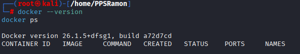
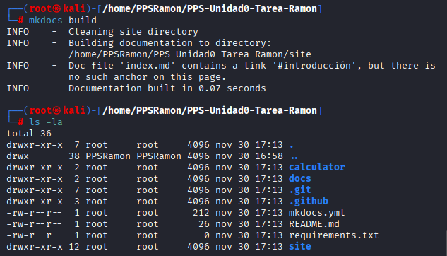
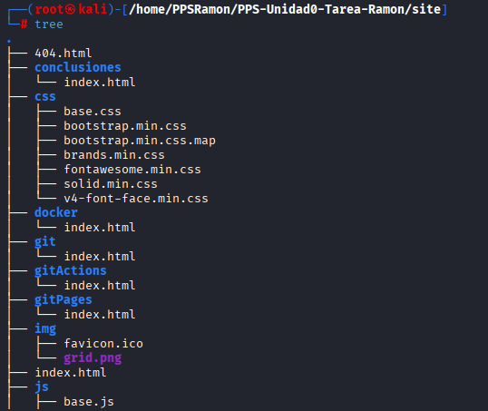
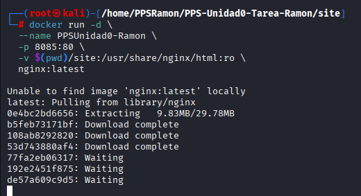
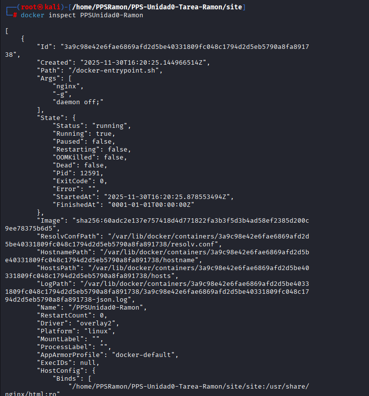
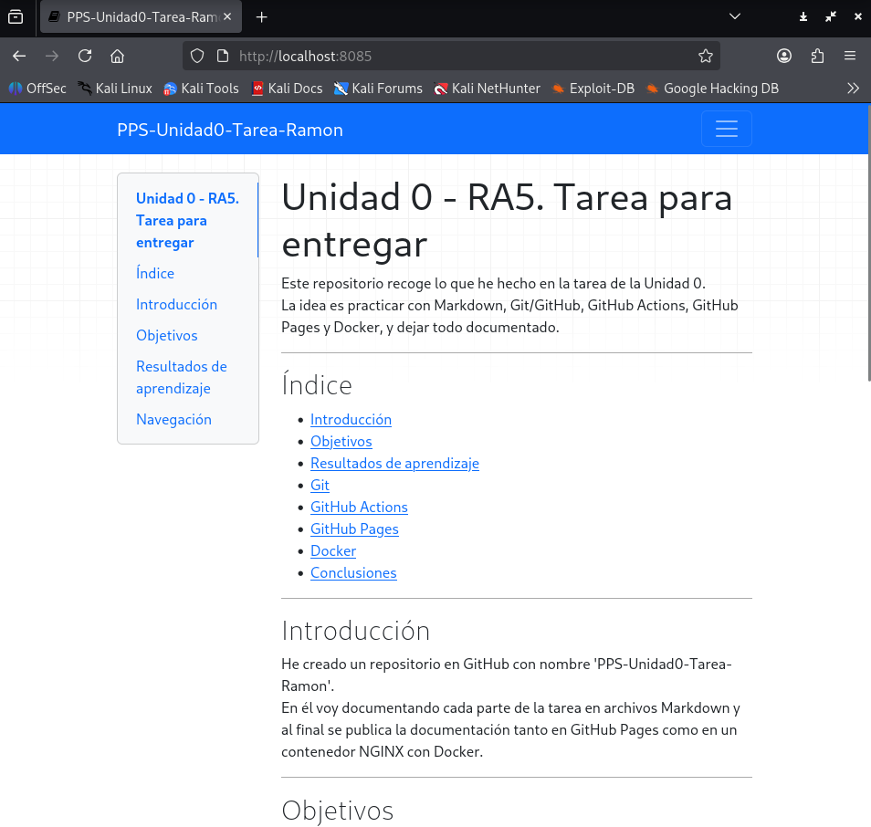

# Documentación del proceso con Docker

En este apartado se documenta la creación y puesta en marcha de un contenedor **NGINX** mediante Docker para mostrar la documentación generada con MkDocs.

---

## 1. Preparación del entorno

Antes de comenzar, aseguramos que Docker está instalado y funcionando correctamente:

```bash
docker --version
docker ps
```




En caso de que no esté instalado Docker:

```bash
apt update
apt install docker.io -y
```

## 2. Preparación
Generar el sitio web estático a partir de la documentación escrita en Markdown y la configuración del proyecto.

```bash
mkdocs build
```






## 3. Creación del contenedor NGINX

Se ha decidido utilizar un contenedor Docker simple con bind mount para montar la carpeta del repositorio en el contenedor.

Comando utilizado:

```bash
docker run -d \
  --name PPSUnidad0-Ramon \
  -p 8085:80 \
  -v $(pwd)/site:/usr/share/nginx/html:ro \
  nginx:latest
```




## 4. Verificación del contenedor
Comprobamos que el contenedor está en ejecución:

```bash
docker ps
```


Inspeccionamos la configuración del contenedor:

```bash
docker inspect PPSUnidad0-Ramon
```




## 5. Visualización de la página
Abrimos el navegador y accedemos a:

```bash
http://localhost:8085
```

Se mostrará correctamente la documentación publicada por MkDocs a través del contenedor NGINX.




## Conclusión

La práctica con Docker permitió comprobar cómo levantar un contenedor NGINX, configurar puertos y volúmenes, y servir la documentación generada con MkDocs. Aunque el uso de GitHub Pages ya cubre la publicación, este ejercicio fue útil para afianzar conceptos básicos de despliegue y administración de contenedores.
