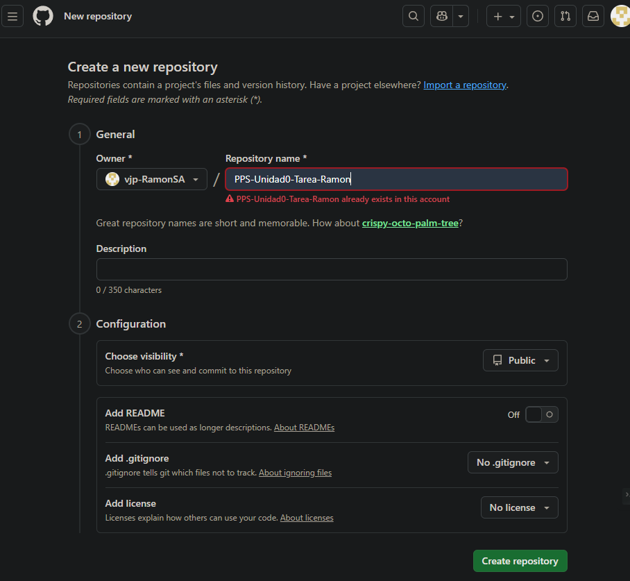
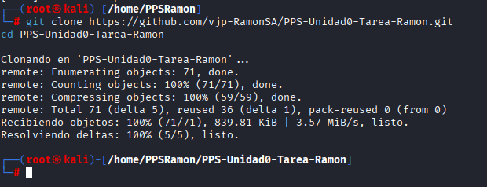
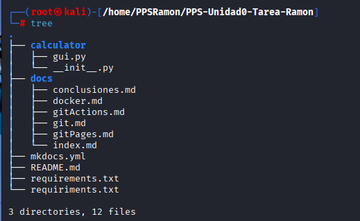
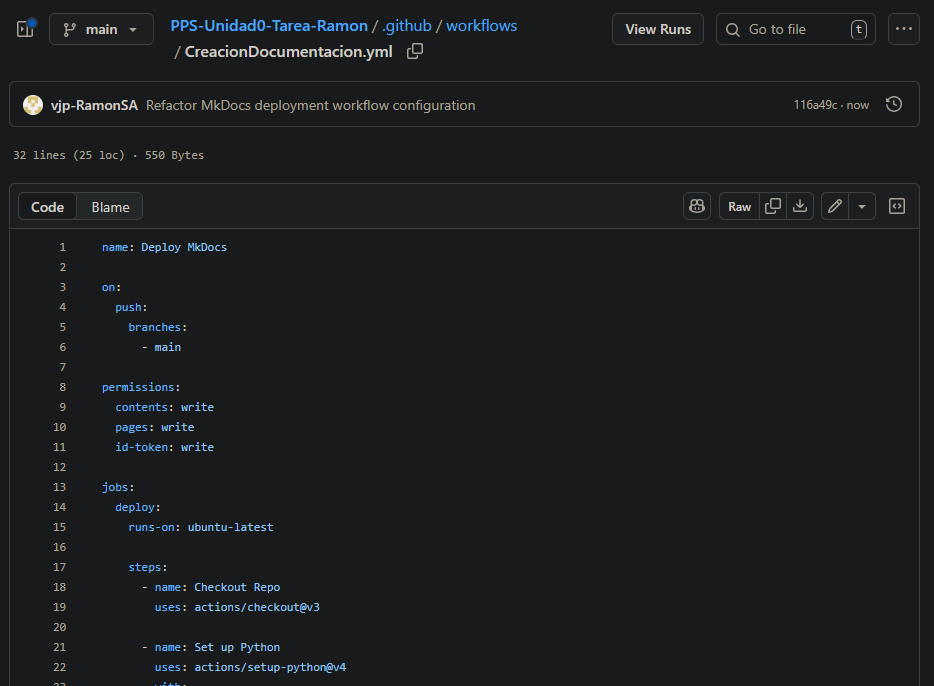

# Gestión del repositorio con Git y GitHub

En este documento se describe el proceso de creación del repositorio en **GitHub** y las operaciones básicas realizadas con **Git** para la tarea de la Unidad 0.

---

## 1. Creación del repositorio en GitHub
1. Accedemos a [GitHub.com](https://github.com).
1. Seleccionamos la opción **New Repository**.
1. Asignar el nombre **PPS-Unidad0-Tarea-Tu_nombre**
1. Configurar:
    - Descripción: *Repositorio para la tarea de la Unidad 0 del módulo PPS.*
    - Visibilidad: **Pública**.
    - Inicializamos de forma opcional con un archivo `README.md`.

 

---

## 2. Configuración inicial
Configuramos nuestro usuario y correo en Git (si no lo teníamos configurado previamente):

```bash
git config --global user.name "tu_nombre"
git config --global user.email "tu_correo"
```

## 3. Clonación del repositorio
Una vez creado el repositorio en GitHub, lo clonamos en nuestra máquina local:

```bash
git clone https://github.com/vjp-RamonSA/PPS-Unidad0-Tarea-Ramon.git
cd PPS-Unidad0-Tarea-Ramon
```

 

## 4. Creación de la estructura de carpetas
Crear la estructura que debe de tener el repositorio:

```bash
PPS-Unidad0-Tarea-Tu_Ramon  
├── calculator/  
│   ├── __init__.py  
│   └── gui.py  
├── docs/  
│   └── index.md    
│   └── git.md  
│   └── gitActions.md   
│   └── gitPages.md  
│   └── docker.md  
│   └── conclusiones.md 
├── mkdocs.yml   
├── requirements.txt  
└── .github/  
    └── workflows/  
        └── CreacionDocumentacion.yml  
```

o utilizar dentro de la carpeta `PPS-Unidad0-Tarea-Ramon` para crear de forma automática y más cómoda:

```bash
# Crear las carpetas directamente
mkdir -p calculator \
         docs \
         .github/workflows

# Crear los archivos vacíos directamente
touch calculator/__init__.py \
      calculator/gui.py \
      docs/index.md \
      docs/git.md \
      docs/gitActions.md \
      docs/gitPages.md \
      docs/docker.md \
      docs/conclusiones.md \
      mkdocs.yml \
      requirements.txt \
      .github/workflows/CreacionDocumentacion.yml

```

 
 

## 5. Primer commit y push

Añadimos los archivos al repositorio y realizamos el primer commit:

```bash
#Preparar todos los archivos modificados y nuevos para ser incluidos en el próximo commit.
git add .

#Crea un nuevo commit en el repositorio para guardar los cambios preparados.
git commit -am "Creación o modificación de archivos"

#Enviar los commits locales al repositorio remoto en la rama main.
git push origin main
```

 


## 6.Añadir colaborador

Finalmente, añadimos al profesor como colaborador:
   * Entramos en Settings > Collaborators.
   * Añadimos el usuario: `PPSvjp`.


 

## Conclusión

La actividad ha servido para comprender de manera práctica cómo trabajar con Git y Markdown dentro de un proyecto real.  

La creación del repositorio en GitHub permitió organizar el código y la documentación de forma estructurada, mientras que la integración con GitHub Actions y GitHub Pages mostró el valor de la automatización y la publicación continua.  

En conjunto, la tarea refuerza la importancia de mantener un flujo de trabajo ordenado y documentado, facilitando la colaboración y el crecimiento del proyecto en futuras unidades.


/gitActions.md

# Configuración de Workflow para MkDocs en GitHub Actions

## 1. Ruta de directorios

Crear la siguiente estructura de carpetas y archivo:

```
.github/
└── workflows/
    └── crearDocumentacion.yml
```

Ejecución del Workflow

El workflow se ejecutará automáticamente cada vez que se haga un push a la rama `main` o `master`.

## 2. Contenido del archivo crearDocumentacion.yml

```bash
name: Deploy MkDocs

on:
  push:
    branches:
      - main

permissions:
  contents: write
  pages: write
  id-token: write

jobs:
  deploy:
    runs-on: ubuntu-latest

    steps:
      - name: Checkout Repo
        uses: actions/checkout@v3

      - name: Set up Python
        uses: actions/setup-python@v4
        with:
          python-version: '3.x'

      - name: Install dependencies
        run: pip install mkdocs

      - name: Deploy docs
        run: mkdocs gh-deploy --force
        env:
          GH_TOKEN: ${{ secrets.GITHUB_TOKEN }}
```

 


## 3. Explicación paso a paso del Workflow MkDocs

## Nombre del workflow
- **`name: Deploy MkDocs`**  
  Define el nombre del workflow.

---

## 3.1. Evento que lo ejecuta
- **`on: push → branches: main`**  
  Indica que el workflow se ejecutará cuando haya un **push** en la rama `main`.

---

## 3.2. Permisos necesarios
Se otorgan permisos para que el workflow pueda desplegar la documentación:

- **`contents: write`** → Modificar contenido del repositorio.  
- **`pages: write`** → Desplegar en GitHub Pages.  
- **`id-token: write`** → Autenticación segura.

---

## 3.3. Job principal
- **`jobs → deploy → runs-on: ubuntu-latest`**  
  El job se ejecuta en un entorno **Ubuntu**.

---

## 3.4. Pasos del workflow
1. **Checkout Repo** → Clona el repositorio.  
1. **Set up Python** → Configura Python en la versión 3.x.  
1. **Install dependencies** → Instala MkDocs.  
1. **Deploy docs** → Publica la documentación en GitHub Pages usando `mkdocs gh-deploy`.


## 4. Conclusión

La configuración de GitHub Actions permitió automatizar el proceso de construcción y despliegue de la documentación.  

Gracias a este flujo de trabajo, cada vez que se actualiza el repositorio la documentación se genera y publica de forma automática en GitHub Pages, asegurando que esté siempre disponible y actualizada sin necesidad de intervención manual.
