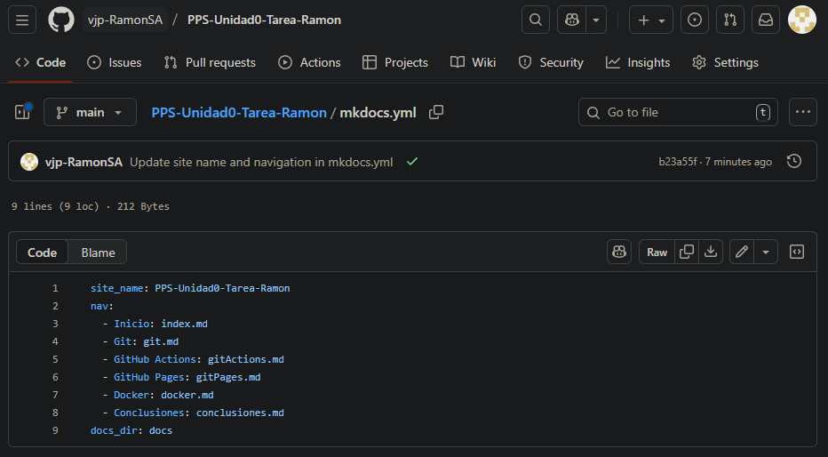

# Publicación de Documentación con GitHub Pages

En este documento se explica el proceso de **configuración y vinculación de GitHub Pages** para publicar la documentación generada con **MkDocs**.  

El objetivo es que la tarea quede accesible en una página web estática alojada en `github.io`.  

---

## Pasos para habilitar GitHub Pages

### 1. Configuración de GitHub Pages
- Dentro de **Settings**, bajar hasta la sección **Pages**.  
- Seleccionar la rama `gh-pages` como fuente de publicación.  
- Guardar los cambios.  


---

### 2. Verificación de la publicación
- GitHub generará automáticamente la URL de tu sitio web en formato:  

```https://UsuarioGithub.github.io/PPS-Unidad0-Tarea-Ramon```

- Esperar unos minutos y acceder a la dirección para comprobar que la documentación se muestra correctamente.  

---

### 3. Ejemplo de configuración en `mkdocs.yml`

```yaml
site_name: PPS-Unidad0-Tarea-Ramon
nav:
  - Inicio: index.md
  - Git: git.md
  - GitHub Actions: gitActions.md
  - GitHub Pages: gitPages.md
  - Docker: docker.md
  - Conclusiones: conclusiones.md
docs_dir: docs
```



---

## 4. Apariencia de la página
- La documentación debe mostrar el menú lateral con las secciones configuradas en `mkdocs.yml`.  

- Verificar que aparecen los apartados: `index`, `git`, `gitActions`, `gitPages`, `docker`, `conclusiones`.  


## Conclusión
La configuración de **GitHub Pages** permite publicar la documentación de forma sencilla y accesible.  

Con este proceso se asegura que el repositorio esté disponible en la web y actualizado automáticamente con cada cambio realizado.
